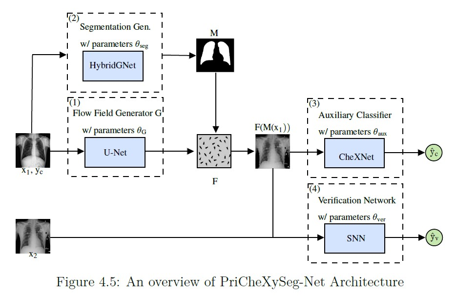
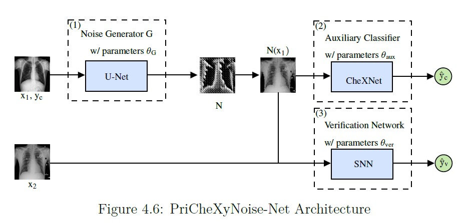

# Chest X-ray Anonymization and Utility Preservation Using Deep Learning-based Techniques

This repository contains the implementation of two deep learning-based models for anonymizing chest radiographs: **PriCheXySeg-Net** and **PriCheXyNoise-Net**. These models aim to protect patient privacy while preserving the diagnostic utility of medical images, as explored in the thesis "Chest X-ray Anonymization and Utility Preservation Using Deep Learning-based Techniques."

## Table of Contents
- [Overview](#overview)
- [Models](#models)
  - [PriCheXySeg-Net Model](#prichexyseg-net-model)
  - [PriCheXyNoise-Net Model](#prichexynoise-net-model)
- [Requirements](#requirements)
- [Installation](#installation)
- [Usage](#usage)
  - [Step 1: Pre-training of the Flow Field Generator](#step-1-pre-training-of-the-flow-field-generator)
  - [Step 2: Training of PriCheXy-Net](#step-2-training-of-prichexy-net)
  - [Step 3: Re-training and Evaluation of the Verification Model](#step-3-re-training-and-evaluation-of-the-verification-model)
  - [Step 4: Evaluation of the Classification Model on Anonymized Data](#step-4-evaluation-of-the-classification-model-on-anonymized-data)
- [Contributors](#contributors)

## Overview

This repository provides code for two proposed deep learning (DL) approaches for anonymizing chest radiographs. The two models are designed to integrate with the PriCheXy-Net framework to enhance privacy while maintaining the utility of diagnostic features in medical images.

## Models

### PriCheXySeg-Net Model

- **Objective:** Enhance the anonymization of chest radiographs by integrating segmentation techniques into the PriCheXy-Net framework. This model focuses on preserving the diagnostic utility of images while effectively obscuring personally identifiable information (PII).

- **Key Features:**
  - **Segmentation Integration:** Utilizes a segmentation model that specifically targets and protects diagnostic areas such as the lungs and heart, ensuring that these regions remain unaltered.
  - **Architecture:**
    - **U-Net-Based Segmentation (HybridGNet):** Employs a U-Net architecture to accurately segment and isolate sensitive areas of the chest radiograph. See [HybridGNet GitHub Repository](https://github.com/ngaggion/HybridGNet) for more details.
    - **Modified PriCheXy-Net:** The segmentation output is integrated into the PriCheXy-Net framework, allowing for selective anonymization of non-diagnostic areas.
  - **Training and Evaluation:** Trained on a combination of chest radiograph datasets with a focus on balancing privacy protection and diagnostic utility.




### PriCheXyNoise-Net Model

- **Objective:** Introduce innovative noise-based perturbation techniques into the anonymization process, enhancing the obfuscation of PII while preserving the clinical utility of chest radiographs.

- **Key Features:**
  - **Noise-Based Perturbation:** Incorporates learned noise techniques to effectively obscure identifiable features within chest radiographs without compromising diagnostic information.
  - **Architecture:**
    - **Integration with PriCheXy-Net:** Seamlessly integrates noise-based perturbation into the PriCheXy-Net framework, allowing for dynamic adjustments based on region sensitivity.
  - **Training and Evaluation:** Trained on the Chest X-ray14 dataset with a focus on optimizing the balance between noise intensity and diagnostic utility.




## Requirements

- **PyTorch:** 1.10.2
- **Python:** 3.9.18

## Installation

1. Clone the repository:
   ``` 
   git clone https://github.com/username/repository.git
   cd repository
   ```

2. Install the required packages:
   ``` 
   pip install -r requirements.txt
   ```

3. Ensure PyTorch is installed:
   ``` 
   pip install torch==1.10.2
   ```

## Usage

### Step 1: Pre-training of the Flow Field Generator

- Update the experiment configuration in \`./config_files/config_pretrain.json\`:
  - \`"generator_type"\`: Choose \`"flow_field"\` for PriCheXySeg-Net or \`"noise"\` for PriCheXyNoise-Net.
  - \`"mu"\` and \`"noise_degree"\`: Set the deformation degree (e.g., \`0.01\`).

- Run the command:
  ``` 
  python3 pretrain_generator.py --config_path ./config_files/ --config config_pretrain.json
  ```

- Note: Pre-trained models are available in \`./networks/\`.

### Step 2: Training of PriCheXy-Net

- Update the experiment configuration in \`./config_files/config_anonymization.json\`:
  - \`"ac_loss_weight"\`: Recommended values are 1, 4, or 8.
  - \`"ver_loss_weight"\`: Use \`1\` for all experiments.
  - \`"generator_type"\`: Choose \`"flow_field"\` for PriCheXySeg-Net or \`"noise"\` for PriCheXyNoise-Net.
  - \`"mu"\` and \`"noise_degree"\`: Set the deformation degree (e.g., \`0.01\`).

- Run the command:
  ``` 
  python3 train_architecture.py --config_path ./config_files/ --config config_anonymization.json
  ```

- Note: Training can take around 17-18 hours, depending on configurations and epochs.

### Step 3: Re-training and Evaluation of the Verification Model

- Update the experiment configuration in \`./config_files/config_retrainSNN.json\`:
  - \`"perturbation_type"\`: Choose \`"flow_field"\` for PriCheXySeg-Net or \`"noise"\` for PriCheXyNoise-Net.
  - \`"perturbation_model_file"\`: Specify the perturbation model (e.g., \`"./networks/generator_lowest_total_loss_mu_0.01.pth"\`).
  - \`"mu"\` and \`"noise_degree"\`: Set the deformation degree (e.g., \`0.01\`).

- Run the command to find the auxiliary classifier score:
  ``` 
  python3 retrain_SNN.py --config_path ./config_files/ --config config_retrainSNN.json
  ```

- To compute the average verification performance, run the experiment multiple times and use the \`compute_meanAUC()\` function found in \`./utils/utils.py\`.

### Step 4: Evaluation of the Classification Model on Anonymized Data

- Update the experiment configuration in \`./config_files/config_eval_classifier.json\`:
  - \`"perturbation_type"\`: Choose \`"flow_field"\` for PriCheXySeg-Net or \`"noise"\` for PriCheXyNoise-Net.
  - \`"perturbation_model_file"\`: Specify the perturbation model (e.g., \`"./networks/generator_lowest_total_loss_mu_0.01.pth"\`).
  - \`"mu"\` and \`"noise_degree"\`: Set the deformation degree (e.g., \`0.01\`).

- Run the command for verification score:
  ``` 
  python3 eval_classifier.py --config_path ./config_files/ --config config_eval_classifier.json
  ```

## Contributors

- **Priyanka Singh**
  - Thesis Advisor: Kai Packhäuser M. Sc.
  - Thesis Co-advisor: Mathias Öttl M. Sc.
  - Supervising Professor: Prof. Dr.-Ing. habil. Andreas Maier

For more information, please refer to the thesis document.
